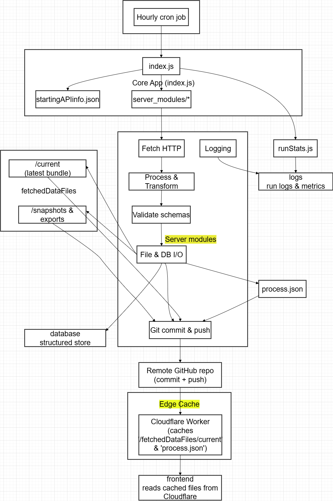

# Backend Server and Data Archival Repository

#### check out the project https://nina-mir.github.io/windborne-job-application/

This repo hosts the codebase for the cloud server in charge of the cron job running hourly to:

- fetch new location data from the Live Constellation API of WindBorne Systems
- Process data and push them to this github repo + archiving old data

## CLoudflare Workers

The choice to use CLoudflare Workers (free tier) to cache the pushed data to GitHub for 60 minutes was made to make the fetch requests from the client side in robust way considering the limitations of the raw.githubusercontent.com content delivery API. 

## Frontend

The frontend make fetch requests to the following API end point to receive the latest war JSON files and processed data:

- https://windborne-systems-job-application.ninamirf.workers.dev/processed.json
- https://windborne-systems-job-application.ninamirf.workers.dev/[00.json, 01.json, etc]

## The Overall application's flowchart

